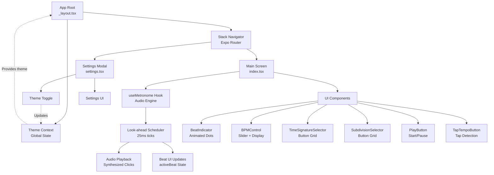

# 🎵 Metronome

A premium, feature-rich metronome application built with React Native and Expo. Designed for musicians, producers, and anyone who needs precise timing control with a modern, intuitive interface.

## ✨ Features

- **Precise BPM Control** — 40–240 BPM range with 1 BPM granularity
- **Tap Tempo Detection** — Tap rhythm to automatically calculate BPM
- **Time Signatures** — Support for 2/4, 3/4, 4/4, 5/4, and 6/8
- **Note Subdivisions** — Quarter notes, eighths, triplets, and sixteenths
- **Animated Beat Indicator** — Visual feedback with smooth spring animations
- **Dark/Light Theme** — Adaptive theming that follows system preferences
- **Haptic Feedback** — Haptic response on tap tempo interactions
- **Settings Panel** — Customize audio volume, vibration, and display options
- **Professional Audio** — Synthesized click sounds with accent beats

## 🛠 Tech Stack

| Layer | Technology | Version |
|-------|-----------|---------|
| **Framework** | Expo | 56.0.4 |
| **Runtime** | React Native | 0.85.3 |
| **UI Framework** | React Native Paper | 5.15.2 |
| **Routing** | Expo Router | ~56.0.0 |
| **Animations** | Reanimated | 3.15.0 |
| **Language** | TypeScript | ~6.0.3 |
| **State Management** | React Hooks | 19.2.3 |
| **Styling** | React Native StyleSheet | Native |
| **Gestures** | React Native Gesture Handler | ~2.30.0 |
| **Safe Area** | React Native Safe Area Context | ~5.6.2 |
| **Fonts** | Expo Google Fonts (Roboto Mono) | 0.4.2 |

## 📋 Architecture



## 🚀 Quick Start

### Prerequisites
- Node.js 16+ and npm
- Expo CLI: `npm install -g expo-cli`
- iOS Simulator (Mac) or Android Emulator (all platforms)
- Physical iOS/Android device for audio support (optional)

### Installation

```bash
# Clone the repository
git clone https://github.com/tmsoontornsing/metronome.git
cd metronome

# Install dependencies
npm install --legacy-peer-deps

# Generate audio assets
node scripts/generateSounds.js
```

### Development

```bash
# Start the Expo development server
npx expo start --clear

# In the terminal, press:
# i - Launch iOS Simulator
# a - Launch Android Emulator
# w - Launch web browser
```

### Building for Device (Audio Support)

Audio requires a native build. To run on a physical device with full audio support:

```bash
# For iOS (requires Xcode)
npx expo run:ios

# For Android (requires Android SDK)
npx expo run:android
```

## 📱 Usage Guide

### Core Controls

**BPM Control**
- Drag the slider to adjust tempo (40–240 BPM)
- Press ± buttons for fine-tuned 1 BPM adjustments
- Display shows current BPM in large, monospace font

**Time Signature**
- Select from 2/4, 3/4, 4/4, 5/4, or 6/8
- Beat indicator updates to show beats per measure
- Changes apply immediately when playing

**Note Division**
- Choose subdivisions: Quarter (♩), Eighth (♪), Triplet (♪♪♪), Sixteenth (♬)
- Divides beats for finer rhythmic control
- Accent beats (beat 1) play at 1000 Hz; others at 660 Hz

**Tap Tempo**
- Tap the "TAP TEMPO" button 4+ times at your desired tempo
- Automatically calculates BPM from tap intervals
- Ignores taps older than 3 seconds

**Settings**
- **Theme** — Auto (system), Dark, or Light
- **Vibrate on Tap** — Haptic feedback toggle
- **Show Beat Numbers** — Display beat count indicator

## 🎛 Architecture Details

### Audio Engine: Look-Ahead Scheduler

The metronome uses a **look-ahead scheduler** pattern to eliminate drift:

```
Every 25ms tick:
  - Calculate next 100ms of audio events
  - Schedule click sounds via setTimeout
  - Update beat UI state
  - Advance internal counters

Result: Precise timing despite JavaScript event loop jitter
```

**Why look-ahead?**
- JavaScript `setInterval` can drift at 500ms intervals (60 BPM)
- Event loop delays cause audio to drift over time
- Look-ahead absorbs up to 100ms of jitter

### State Management

**useRef (Timing-Critical)**
- `nextSubdivTimeRef` — Next scheduled audio time
- `currentBeatRef` — Current beat in measure
- `bpmRef` — Current tempo
- *Zero re-render overhead*

**useState (UI-Driven)**
- `bpm` — Display BPM value
- `isPlaying` — Play/pause state
- `activeBeat` — Current beat for animations

### Theme System

Uses React Native Paper's Material Design 3 with custom colors:
- **Primary** — #30C878 (modern green)
- **Dark Background** — #09090B
- **Dark Surface** — #161618
- Automatically switches based on system preference or user override

## 📦 Project Structure

```
metronome/
├── app/                           # Expo Router screens
│   ├── _layout.tsx               # Root layout, theme provider
│   ├── index.tsx                 # Main metronome screen
│   └── settings.tsx              # Settings modal
├── components/                    # Reusable UI components
│   ├── BeatIndicator.tsx         # Animated beat dots
│   ├── BPMControl.tsx            # Tempo slider & display
│   ├── PlayButton.tsx            # Start/pause button
│   ├── TapTempoButton.tsx        # Tap detection
│   ├── TimeSignatureSelector.tsx # Time signature picker
│   └── SubdivisionSelector.tsx   # Subdivision picker
├── hooks/                         # Custom React hooks
│   ├── useMetronome.ts           # Audio engine & state
│   └── useAppTheme.ts            # Theme management
├── theme/                         # Design tokens
│   └── index.ts                  # Material Design 3 theme
├── assets/
│   └── sounds/                    # Generated audio files
│       ├── click-accent.wav      # Beat 1 sound (1000 Hz)
│       └── click-normal.wav      # Other beats (660 Hz)
├── scripts/
│   └── generateSounds.js          # Audio asset generation
├── app.json                       # Expo configuration
├── package.json                   # Dependencies
├── tsconfig.json                  # TypeScript config
└── babel.config.js                # Babel configuration
```

## 🔧 Configuration

### Audio Mode (iOS)
The app requires special audio permissions on iOS:

```json
// app.json
"ios": {
  "infoPlist": {
    "UIBackgroundModes": ["audio"]
  }
}
```

This allows the metronome to continue running:
- When the device mute switch is enabled
- When the app runs in the background
- While the screen is locked

### Babel Configuration
Reanimated requires Babel plugin configuration:

```javascript
// babel.config.js
plugins: [
  ['react-native-reanimated/plugin']
]
```

## 🧪 Testing Checklist

- [ ] **Timing Accuracy** — Run at 60 BPM for 60 seconds, compare with reference
- [ ] **Tap Tempo** — Tap 4+ times at ~100 BPM, verify convergence
- [ ] **Time Signatures** — Switch between all signatures while playing
- [ ] **Subdivisions** — Verify subdivision sounds at correct intervals
- [ ] **Theme Switching** — Toggle light/dark, verify instant update
- [ ] **Settings Persistence** — Change settings, verify they persist
- [ ] **Audio on Device** — Test on physical iOS/Android device for sound
- [ ] **Background Audio** — Press home button, verify metronome continues

## 🤝 Contributing

Contributions are welcome! To contribute:

1. Fork the repository
2. Create a feature branch (`git checkout -b feature/amazing-feature`)
3. Commit your changes (`git commit -m 'Add amazing feature'`)
4. Push to the branch (`git push origin feature/amazing-feature`)
5. Open a Pull Request

### Development Guidelines
- Write TypeScript, not JavaScript
- Use React hooks for state management
- Follow React Native Paper component patterns
- Test on both iOS and Android when possible
- Keep the codebase organized by domain (hooks, components, screens)

## 📝 License

This project is licensed under the MIT License. See the LICENSE file for details.

## 🎵 Acknowledgments

- Built with [Expo](https://expo.dev)
- UI powered by [React Native Paper](https://reactnativepaper.com)
- Animations with [Reanimated](https://docs.swmansion.com/react-native-reanimated/)
- Icons from [Material Community Icons](https://materialdesignicons.com)

## 📧 Contact

For questions, feature requests, or bug reports, please open an issue on GitHub.

---

**Made with ❤️ by Tonimaxsx**
